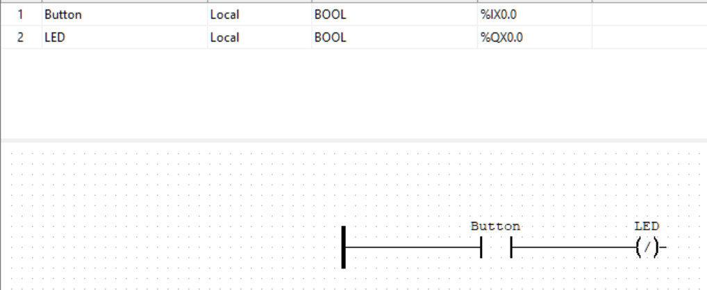

# 01 - Button LED

Basic digital I/O test using the onboard button and LED on the Nucleo F411RE.

## What It Does
Press the blue user button (B1) → LED (LD2) turns on. Release → LED turns off.

## Hardware
- STM32 Nucleo F411RE
- Onboard button B1 (PC13)
- Onboard LED LD2 (PA5)

## Ladder Logic

Simple normally-closed contact controlling a coil. Contact is negated because the button is active-low (pressed = 0V, released = 3.3V).

## Pin Mapping
| Function | STM32 Pin | Address |
|----------|-----------|---------|
| Button B1 | PC13 | %IX0.0 |
| LED LD2 | PA5 | %QX0.0 |

## Lessons Learned
- Nucleo's onboard button is active-low, requiring a negated contact
- OpenPLC's Blackpill board definition needed I/O config changes for Nucleo pins
- PA5 was listed in both Digital Outputs and Analog Inputs, causing conflicts
