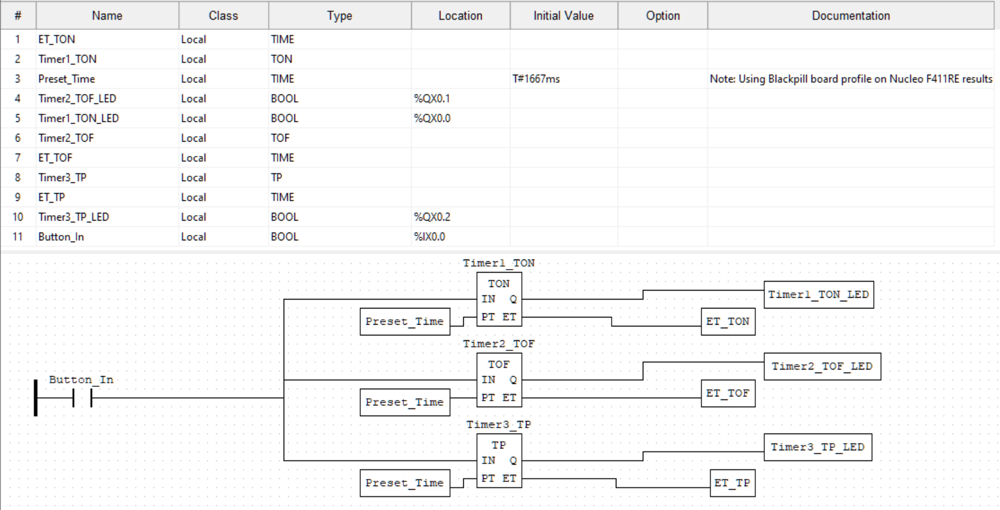

# P3 – PLC Timer Instructions (IEC 61131-3)

## Overview

This project demonstrates the three core IEC 61131-3 timer instructions—**TON**, **TOF**, and **TP**—using **OpenPLC** on an **STM32 Nucleo-F411RE** development board. A single pushbutton input drives three independent timers, each controlling an LED to clearly illustrate the behavioral differences between timer types.

This project was completed as a self-guided PLC fundamentals exercise with an emphasis on running and validating logic on real hardware rather than simulation.

## Implementation

The ladder logic consists of a single input driving three timer function blocks in parallel. Each timer operates independently but shares the same input and preset time, allowing direct comparison of behavior under identical conditions.

## Demo

## Hardware

### Components

* STM32 Nucleo-F411RE
* 1× momentary pushbutton
* 3× LEDs
* 3× current-limiting resistors (100Ω used)
* Breadboard and jumper wires

### I/O Mapping

| Signal     | OpenPLC Address | MCU Pin | Connector   |
| ---------- | --------------- | ------- | ----------- |
| Pushbutton | `%IX0.0`        | PA8     | Arduino D7  |
| TON LED    | `%QX0.0`        | PB10    | Arduino D6  |
| TOF LED    | `%QX0.1`        | PB12    | Morpho CN10 |
| TP LED     | `%QX0.2`        | PB13    | Morpho CN10 |

### Wiring Notes

* Pushbutton wired between PA8 and GND (internal pull-up enabled).
* LED anodes connected to output pins.
* LED cathodes routed through resistors to GND.
* PB12 and PB13 are only accessible via the ST morpho headers (not Arduino headers).

## Timer Configuration

All timers use a nominal **5-second preset** for clarity during observation.

**Preset Value:** `T#1667ms`  
Adjusted to compensate for timing inaccuracy caused by using the Blackpill STM32-F411 board profile on Nucleo-F411RE hardware.

### TON – On-Delay

* Input must remain TRUE for the preset duration before output energizes.
* Output de-energizes immediately when input goes FALSE.
* Typical uses: startup delays, debounce filtering, short-cycle protection.

### TOF – Off-Delay

* Output energizes immediately with input.
* Output remains ON for the preset duration after input goes FALSE.
* Typical uses: fan rundown, lighting delays, post-operation cooling.

### TP – Pulse

* Rising edge of the input triggers a fixed-duration pulse.
* Input changes during the pulse are ignored.
* Typical uses: one-shot triggers, timed actuations, alarm pulses.

### Function Block Interface

All IEC 61131-3 timer function blocks share the same interface:

* `IN` – Enable input (BOOL)
* `PT` – Preset time (TIME)
* `Q` – Output (BOOL)
* `ET` – Elapsed time (TIME)

## Lessons Learned

* **OpenPLC I/O mapping is global**, not project-specific. Pin assignments must be verified when switching boards or projects.
* **I/O address assignment follows configuration order**, not physical pin order.
* **Board profiles affect timing accuracy.** Using the Blackpill F411 profile on a Nucleo-F411RE resulted in timers running approximately 3× slower due to clock differences.
* **Physical inputs require mapped variables.** Local BOOL variables without `%IX` addresses will not read hardware states.
* **LED polarity matters.** Reversed wiring results in inverted output logic.
* **Floating voltages (~300–500 mV)** typically indicate incorrect pin selection or misconfiguration.
* **100Ω resistors function but run LEDs at higher current.** 220–330Ω is preferable for long-term use.
* **Timer presets can be shared.** Multiple timer instances can safely reference the same TIME variable.

## Industrial Context

Timer instructions are fundamental in industrial control systems and are commonly used for:

* Preventing mechanical and electrical stress
* Sequencing multi-stage processes
* Filtering transient input conditions
* Generating deterministic control pulses
* Coordinating auxiliary equipment and subsystems

Understanding timer behavior on real hardware is essential before deploying control logic in production environments.

## Repository Contents

* `plc.xml` – OpenPLC project file
* `README.md` – Project documentation
* `TimerDemo.gif` – Hardware demonstration recording
* `timers_logic.png` – Ladder logic screenshot

## Author

John West
Electrical and Computer Engineering Technology Student

## Date

December 2025