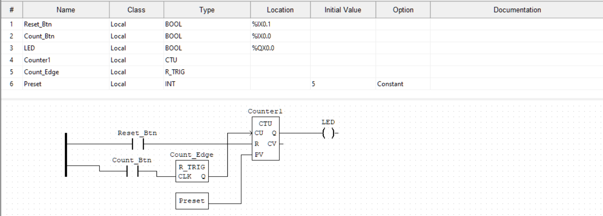

# P4 – PLC Counter Instructions (IEC 61131-3)

## Overview

This project demonstrates a basic counter circuit using IEC 61131-3 CTU (Count Up) instruction with a reset function. A single pushbutton increments a counter, and a second button resets it. When the count reaches a preset value (5 in this implementation), an LED illuminates to indicate the condition has been met.

This type of circuit forms the foundation for numerous industrial applications, including parts counting on conveyor belts, production batch tracking, and event monitoring in manufacturing processes.

## Implementation

The ladder logic implements a rising-edge triggered CTU counter with manual reset capability. A rising edge detector ensures clean, single increments per button press, and the counter's Q output drives an LED when the preset value is reached or exceeded.

##Demo

Demonstration: Five button presses trigger the LED, followed by reset

## Hardware

### Components

* STM32 Nucleo-F411RE development board
* 2× momentary pushbuttons (Count and Reset)
* 1× LED (red used for indication)
* 3× resistors (2× 10kΩ pull-downs, 1× 330Ω current-limiting)
* Breadboard and jumper wires

### I/O Mapping

| Signal     | OpenPLC Address | MCU Pin | Connector   |
| ---------- | --------------- | ------- | ----------- |
| Count_Btn  | `%IX0.0`        | PA8     | Arduino D7  |
| Reset_Btn  | `%IX0.1`        | PB6     | Arduino D10 |
| LED        | `%QX0.0`        | PB10    | Arduino D6  |

### Wiring Configuration

* Count Button: PA8 → Button → 3.3V with 10kΩ pull-down resistor to GND
* Reset Button: PB6 → Button → 3.3V with 10kΩ pull-down resistor to GND
* LED: PB10 → LED Anode → 330Ω Resistor → GND

### Counter Configuration

* CTU – Count Up Function Block

**Parameters:**
* Preset Value (PV): 5 (configurable via constant or variable)
* Count Input (CU): Rising edge triggered via R_TRIG
* Reset Input (R): Active high immediate reset

### Function Block Interface:

* `CU` – Count Up input (BOOL, rising edge sensitive)
* `R` – Reset input (BOOL)
* `PV` – Preset value (INT)
* `Q` – Output (BOOL, TRUE when CV ≥ PV)
* `CV` – Current value (INT)

### Logic Behavior

* **Increment:** Each rising edge on Count Button increments CV by 1
* **Output Activation:** When CV reaches or exceeds PV (5), Q output becomes TRUE, illuminating LED
* **Reset:** Reset Button immediately sets CV to 0, Q becomes FALSE, LED turns off
* **Continuation:** Counter continues incrementing beyond preset value, with output remaining active

###Lessons Learned

*Edge detection is critical for counting applications to prevent multiple counts from a single button press
* Counter reset functions must be designed for both manual (button) and automatic (process) reset scenarios
* OpenPLC's variable scoping requires careful attention - I/O mapping in Hardware Layer is separate from program variable declaration
* Physical button bounce becomes less critical with proper rising edge detection in ladder logic
* Counter preset values should typically be stored as variables (not constants) in industrial applications for operator adjustment
* The relationship between Q output and CV is important - Q remains active even when CV exceeds PV

##Industrial Context
 
* Counter instructions are fundamental in industrial automation with applications including:
* Conveyor belt part counting - Tracking components through assembly lines
* Batch production control - Monitoring units per batch and triggering next process
* Packaging operations - Counting items per box or pallet
* Equipment runtime tracking - Monitoring operational hours for maintenance scheduling
* Quality control - Counting acceptable vs. rejected parts
* Inventory management - Tracking raw material usage and finished goods

This simple counter-reset circuit represents the core logic behind thousands of industrial counting applications, where reliability and accuracy are critical for production efficiency.

##Repository Contents

* `plc.xml` – OpenPLC project file
* `README.md` – Project documentation
* `P4_demo.gif` – Hardware demonstration recording
* `counter_logic.png` – Ladder logic screenshot

## Author

John West
Electrical and Computer Engineering Technology Student

Date
December 2025